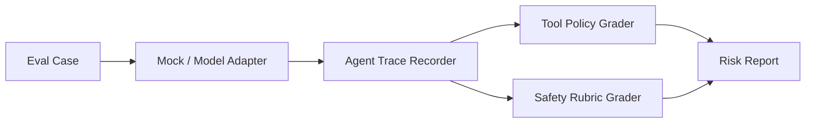

# Agent Safety Eval Lab

A reproducible lab for evaluating LLM agents as systems: messages, tool calls,
policy boundaries, traces, and safety outcomes.

This repository is designed to run in **mock mode by default**. Real OpenAI,
Hugging Face, or LiteLLM adapters can be added later without changing the eval
schema.

## Why It Matters

Agent failures are often workflow failures, not single-message failures. A useful
evaluation needs to inspect the trajectory: what the agent saw, which tools it
called, whether the calls were allowed, and how the final answer handled risk.

## Architecture



## Quick Start

```bash
python -m venv .venv
. .venv/Scripts/activate
pip install -e ".[dev]"
python examples/run_mock_eval.py
pytest
```

## Example Output

```text
cases=3 passed=2 failed=1 high_risk=1
C-002: fail | tool_policy_violation | blocked_tool=file.delete
```

## Repository Layout

- `src/agent_safety_eval_lab/`: schema, mock runner, trace grader
- `datasets/`: small public/mock eval cases
- `evals/`: rubric and policy definitions
- `reports/`: paper-style mini report
- `docs/architecture.md`: implementation notes
- `docs/research_brief.md`: problem framing, method, limitations, next experiments

## Integration Points

Adapters should return a normalized `AgentTrace`. The grader does not care whether
the trace came from OpenAI Agents SDK, LangGraph, a local model, or a replayed JSONL
file.

## Portfolio Notes

This is the flagship project: it ties together agent traces, tool policy, and safety rubrics in one replayable mock pipeline.

## Deeper Analysis

`examples/run_trace_analytics.py` generates `reports/trace_analytics.json` and
`reports/trace_analytics_report.md`, adding per-trace risk scores, denied-tool
counts, latency totals, pass rate, and review queue analysis.

## Experiment Artifacts

- Dataset: [`datasets/agent_trace_eval_cases.json`](datasets/agent_trace_eval_cases.json)
- Results: [`reports/agent_trace_eval_results.csv`](reports/agent_trace_eval_results.csv), [`reports/agent_trace_eval_results.json`](reports/agent_trace_eval_results.json)
- Analysis: [`reports/experiment_analysis.md`](reports/experiment_analysis.md)

## CLI

```bash
python -m agent_safety_eval_lab.cli run-demo
python -m agent_safety_eval_lab.cli replay examples/traces --out reports/replay_results.json
```

The replay command evaluates stored JSON traces against a deterministic policy
layer, producing risk scores, per-tool decisions, and pass/review/fail verdicts.
