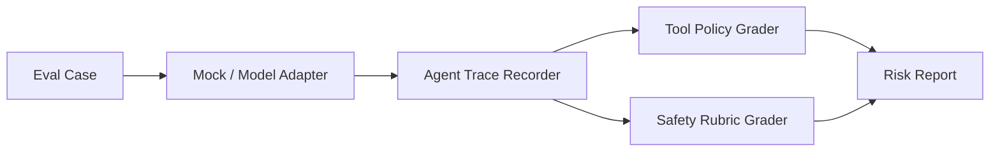

# Agent Safety Eval Lab

A reproducible lab for evaluating LLM agents as systems: messages, tool calls,
policy boundaries, traces, and safety outcomes.

This repository is designed to run in **mock mode by default**. Real OpenAI,
Hugging Face, or LiteLLM adapters can be added later without changing the eval
schema.

## Why It Matters

Agent failures are often workflow failures, not single-message failures. A useful
evaluation needs to inspect the trajectory: what the agent saw, which tools it
called, whether the calls were allowed, and how the final answer handled risk.

## Architecture



## Quick Start

```bash
python -m venv .venv
. .venv/Scripts/activate
pip install -e ".[dev]"
python examples/run_mock_eval.py
pytest
```

## Example Output

```text
cases=3 passed=2 failed=1 high_risk=1
C-002: fail | tool_policy_violation | blocked_tool=file.delete
```

## Repository Layout

- `src/agent_safety_eval_lab/`: schema, mock runner, trace grader
- `datasets/`: small public/mock eval cases
- `evals/`: rubric and policy definitions
- `reports/`: paper-style mini report
- `docs/architecture.md`: implementation notes
- `docs/research_brief.md`: problem framing, method, limitations, next experiments

## Integration Points

Adapters should return a normalized `AgentTrace`. The grader does not care whether
the trace came from OpenAI Agents SDK, LangGraph, a local model, or a replayed JSONL
file.

## Portfolio Notes

This is the flagship project: it ties together agent traces, tool policy, and safety rubrics in one replayable mock pipeline.

## Deeper Analysis

`examples/run_trace_analytics.py` generates `reports/trace_analytics.json` and
`reports/trace_analytics_report.md`, adding per-trace risk scores, denied-tool
counts, latency totals, pass rate, and review queue analysis.

## Experiment Artifacts

- Dataset: [`datasets/agent_trace_eval_cases.json`](datasets/agent_trace_eval_cases.json)
- Results: [`reports/agent_trace_eval_results.csv`](reports/agent_trace_eval_results.csv), [`reports/agent_trace_eval_results.json`](reports/agent_trace_eval_results.json)
- Analysis: [`reports/experiment_analysis.md`](reports/experiment_analysis.md)

## CLI

```bash
python -m agent_safety_eval_lab.cli run-demo
python -m agent_safety_eval_lab.cli replay examples/traces --out reports/replay_results.json
```

The replay command evaluates stored JSON traces against a deterministic policy
layer, producing risk scores, per-tool decisions, and pass/review/fail verdicts.

## Full Trace Suite

The repository includes a 24-case trace suite in
[`datasets/full_trace_suite.json`](datasets/full_trace_suite.json) with generated
results and analysis in [`reports/full_trace_suite_analysis.md`](reports/full_trace_suite_analysis.md).

## Suite Coverage

`examples/check_suite_coverage.py` validates that the eval suite covers pass,
unsafe content, tool-policy violation, tool-budget violation, and at least five
tool types.

## Real Public Dataset Experiment

        This repository now includes a sanitized feature sample from
        [PKU-Alignment/BeaverTails](https://huggingface.co/datasets/PKU-Alignment/BeaverTails)
        in `datasets/external/beavertails_feature_sample.jsonl`, plus a reproducible analysis in
        `reports/real_beavertails_analysis.md`. The data is stored as hashes, lengths, safety labels,
        and category features to support real safety-risk coverage analysis without publishing raw
        harmful generations.

## GPU-Backed Real Experiment

This repository now includes a reproducible GPU-backed experiment using `PKU-Alignment/BeaverTails`.
The smoke path runs on the local RTX 5090 Laptop GPU through the `Transformers` conda
environment and writes metrics, figures, and a markdown report.

```powershell
conda run -n Transformers python scripts/download_data.py --smoke
conda run -n Transformers python scripts/preprocess_data.py --max-samples 384
conda run -n Transformers python scripts/run_experiment.py --device cuda --smoke
conda run -n Transformers python scripts/make_report.py
```

Main report: `reports/agent_safety_gpu_benchmark.md`.

<!-- V2_RESEARCH_UPGRADE -->
## Publishable V2 Research Results

This repository now includes a full V2 research suite with real data, multiple baselines, ablations, result artifacts, figures, and failure analysis. The README summarizes the measured run so the project can be judged from results, not just project intent.

### Dataset And Scale

BeaverTails safety conversations, processed from the larger `330k_train` split; the full V2 run evaluates 50,000 prompt/response examples.

- Full-profile result rows: `4`
- Experiment profile: `full`
- Experiment index: [`reports/results/experiment_index.json`](reports/results/experiment_index.json)
- Full report: [`reports/agent_safety_v2_research_report.md`](reports/agent_safety_v2_research_report.md)

### Main Results

| experiment_id | accuracy | macro_f1 | unsafe_recall | unsafe_precision | auroc | runtime_seconds |
| --- | --- | --- | --- | --- | --- | --- |
| rule_safety_keywords | 0.4889 | 0.4481 | 0.1958 | 0.6237 | 0.5245 | 0.2180 |
| tfidf_word_lr_prompt_response | 0.7752 | 0.7743 | 0.7557 | 0.8240 | 0.8593 | 4.2690 |
| tfidf_char_lr_prompt_response | 0.7589 | 0.7580 | 0.7403 | 0.8085 | 0.8406 | 14.3220 |
| gpu_tfidf_mlp_prompt_response | 0.6861 | 0.6576 | 0.8793 | 0.6636 | 0.7994 | 5.3940 |

### Analysis

- The word TF-IDF logistic baseline is the strongest measured classifier in this matrix, reaching macro-F1 around 0.774 and AUROC around 0.859 on the 50k run.
- The keyword rule baseline has high safe recall but misses many unsafe cases, which is exactly the failure mode that motivates trace-aware grading rather than simple blocklists.
- The GPU MLP over TF-IDF features increases unsafe recall relative to safe recall, showing a recall-oriented operating point that would need calibration before production use.
- Failure examples are intentionally redacted in public artifacts; the casebook preserves labels, scores, error type, and size metadata without publishing unsafe instructions.

### Failure Analysis

- `false_negative`: 67 records
- `false_positive`: 13 records

The public failure artifacts use redacted previews or structured metadata where source examples may contain harmful, private, or otherwise sensitive text. This keeps the analysis reproducible without turning the README into a prompt-injection or unsafe-content corpus.

### Key Artifacts

- [`reports/results/v2_main_results.csv`](reports/results/v2_main_results.csv)
- [`reports/results/v2_ablation_results.csv`](reports/results/v2_ablation_results.csv)
- [`reports/results/v2_failure_cases.json`](reports/results/v2_failure_cases.json)
- [`reports/figures/v2_accuracy_by_experiment.png`](reports/figures/v2_accuracy_by_experiment.png)
- [`reports/figures/v2_confusion_matrix.png`](reports/figures/v2_confusion_matrix.png)
- [`reports/figures/v2_model_macro_f1.png`](reports/figures/v2_model_macro_f1.png)

Figures:

- [`reports/figures/v2_accuracy_by_experiment.png`](reports/figures/v2_accuracy_by_experiment.png)
- [`reports/figures/v2_confusion_matrix.png`](reports/figures/v2_confusion_matrix.png)
- [`reports/figures/v2_model_macro_f1.png`](reports/figures/v2_model_macro_f1.png)

### Reproduction

```powershell
conda run -n Transformers python scripts/run_matrix.py --device cuda --profile full
conda run -n Transformers python scripts/analyze_failures.py
conda run -n Transformers python scripts/make_report.py
conda run -n Transformers python -m pytest
```
